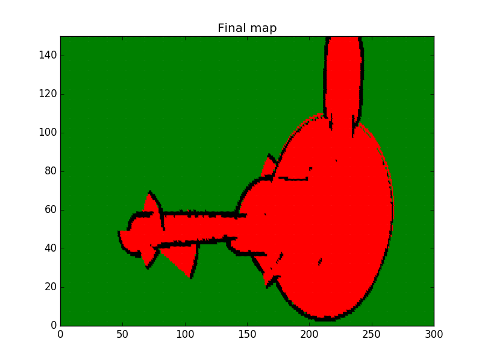

[](https://www.udacity.com/robotics)

# RoboND-OccupancyGridMappingAlgorithm
Visualize the mapped environment through the generated image

Check out this [link](https://github.com/lava/matplotlib-cpp) for more information on the `matplotlib` C++ library. For information regarding the plot color and shape refer to the LineSpec and LineColor section of the [MATLAB](https://www.mathworks.com/help/matlab/ref/plot.html?requestedDomain=true) documentation. 

### Compiling
```sh
$ git clone https://github.com/navinrahim/RoboND-Occupancy-Grid-Mapping-Algorithm
$ cd RoboND-OccupancyGridMappingAlgorithm/
$ rm -rf Images/* #Delete the folder content and not the folder itself!
$ g++ main.cpp -o app -std=c++11 -I/usr/include/python2.7 -lpython2.7
```

### Running
```sh
$ ./app
```

Now, wait for the program to generate the map in the Images folder!

### Generated Map



